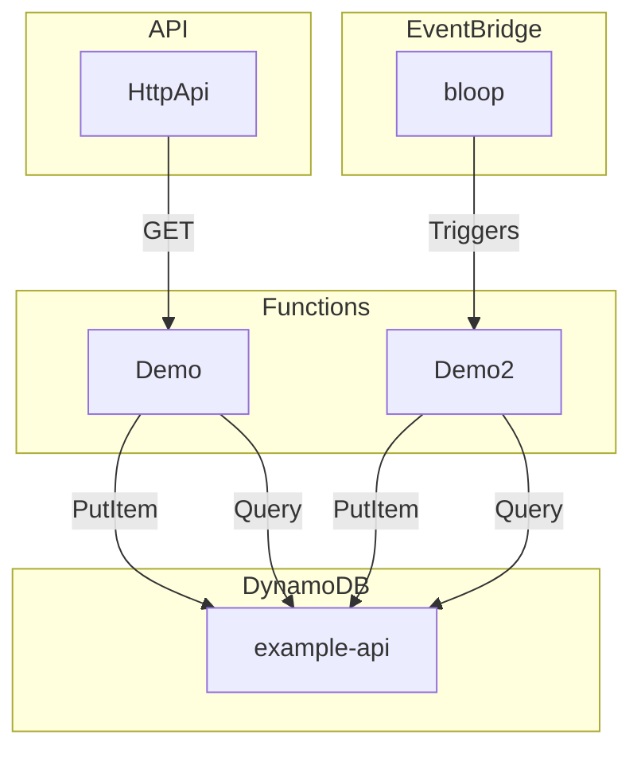

# samaid

**🪄 Magically transform AWS SAM templates to Mermaid diagrams 🪄**


Ever wanted to quickly and painlessly just magically get Mermaid templates from your AWS SAM templates? That's what **samaid** does for you.

The support is still limited and is first and foremost adapted for common needs in my own contexts. It currently supports DynamoDB (`AWS::DynamoDB::Table`), Lambda functions (`AWS::Serverless::Function`), HTTP APIs (`AWS::Serverless::HttpApi`), and S3 (`AWS::S3::Bucket`).

## Usage

### Basic importing and usage

```typescript
// ES5 format
const { Samaid } = require('samaid');
// ES6 format
import { Samaid } from 'samaid';

// By default, samaid returns the Mermaid data
const mermaidDiagram = new Samaid(filePath).generate();

// Write the file to disk by passing an optional output path
new Samaid(filePath).generate(outputPath);

// Update your README with the diagram data (see more below)
new Samaid(filePath).generate(outputPath, true);
```

### Defaults and assumptions

You must have a SAM template named `template.yml`.

If you do not provide an output file name, then `samaid.diagram.mmd` will be used.

An output file name must use the `.mmd` ending.

If you want to have your README file updated, the area between the start and end markers `<!-- START DIAGRAM -->` and `<!-- END DIAGRAM -->` will be used.

## Example

**samaid** uses a bit of test data for a simple service which converts to this Mermaid diagram:



Much more complex stacks are supported too, as long as the infrastructure is supported (see above).

## License

MIT. See `LICENSE` file.
