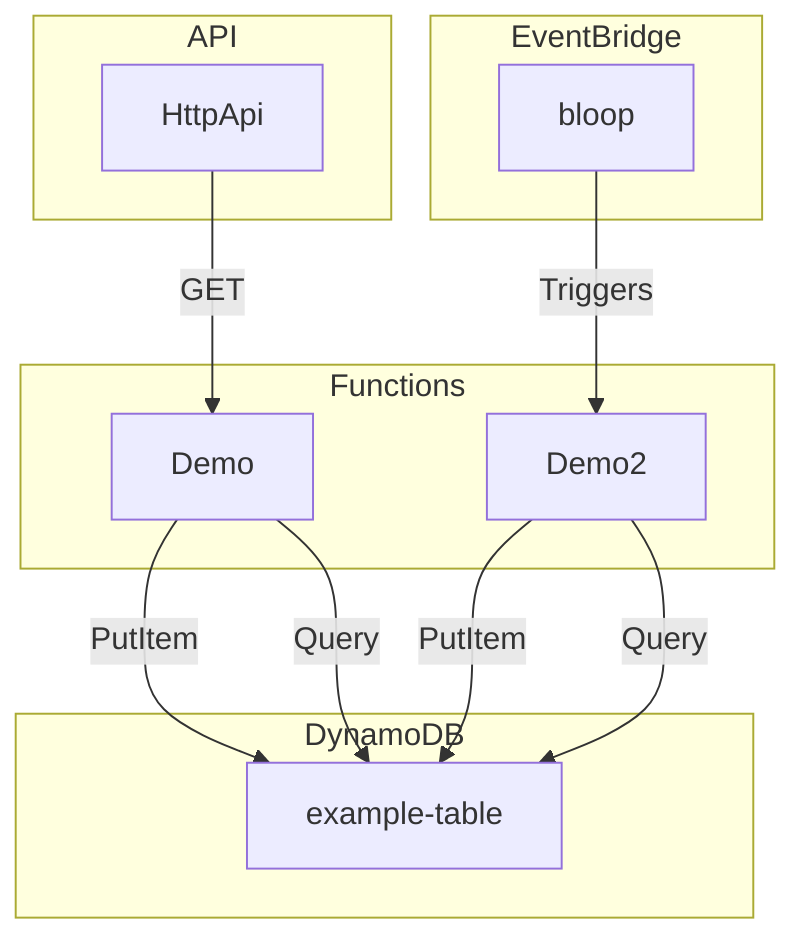

# samaid

**🪄 Magically transform AWS SAM templates to Mermaid diagrams 🪄**


Ever wanted to quickly and painlessly just magically get Mermaid templates from your AWS SAM templates? That's what **samaid** does for you.

**samaid** supports both being run as a Node module and as a CLI tool.

## Name

Why the name?! SAM + Mermaid = samaid.

## Usage

First, install the module with `npm install samaid`.

### Node module example

```typescript
// ES5 format
const { Samaid } = require('samaid');
// ES6 format
import { Samaid } from 'samaid';

// By default, samaid returns the Mermaid data
const mermaidDiagram = new Samaid(filePath).generate();

// Write the file to disk by passing an optional output path
new Samaid(filePath).generate(outputPath);

// Update your README with the diagram data (see more below)
new Samaid(filePath).generate(outputPath, true);
```

### CLI tool examples

```bash
npx samaid

# Update README
npx samaid --readme

# Output to a file
npx samaid --output my_diagram.mmd
npx samaid -o my_diagram.mmd

# Use a template at a specific path
npx samaid --template my_template.yml
npx samaid -t my_template.yml
```

All commands can be combined.

If you do not provide a template name, then `template.yml` will be used.

An output file name must use the `.mmd` ending.

## Infrastructure support

The infra support is still limited and is first and foremost adapted for common needs in my own contexts. It currently supports DynamoDB (`AWS::DynamoDB::Table`), Lambda functions (`AWS::Serverless::Function`), HTTP APIs (`AWS::Serverless::HttpApi`), and S3 (`AWS::S3::Bucket`).

## Updating README with your diagram

If you want to have your `README.md` file updated with the diagram, the area between the start and end markers `<!-- START DIAGRAM -->` and `<!-- END DIAGRAM -->` will be used.

## Example

**samaid** uses a bit of test data for a simple service which converts to this Mermaid diagram:



Much more complex stacks are supported too, as long as the infrastructure is supported (see above).

## License

MIT. See `LICENSE` file.
